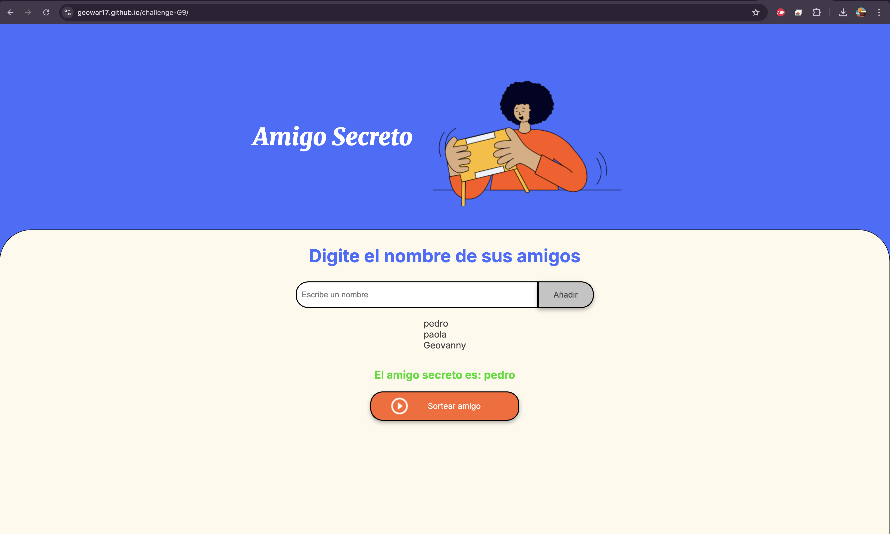

# 🎁 Amigo Secreto

Aplicación web simple que permite a los usuarios ingresar nombres de amigos en una lista para luego realizar un sorteo aleatorio y determinar quién es el "amigo secreto".

---

## 🖼️ Captura de pantalla



---

## ✨ Funcionalidades

- ✅ **Agregar nombres:** los usuarios pueden ingresar nombres y agregarlos a una lista visible.
- 🚫 **Validación:** si el campo de texto está vacío, se muestra una alerta pidiendo un nombre válido.
- 👥 **Lista visible:** los nombres se muestran en pantalla a medida que se agregan.
- 🎲 **Sorteo aleatorio:** al hacer clic en "Sortear Amigo", se selecciona un nombre aleatorio de la lista y se muestra como el amigo secreto.

---

## 🛠️ Tecnologías utilizadas

- **HTML5** – estructura de la interfaz
- **CSS3** – diseño visual personalizado
- **JavaScript (Vanilla JS)** – lógica de interacción y sorteo

---

## 📁 Estructura del proyecto

```
/amigo-secreto/
│
├── index.html         # Estructura HTML principal
├── style.css          # Estilos personalizados
├── app.js             # Lógica JavaScript funcional
├── /assets/
│   ├── amigo-secreto.png
│   └── screenshot.png  # Captura de pantalla del proyecto
```

---

## 🚀 Cómo usar

1. Clona el repositorio o descarga los archivos.
2. Abre `index.html` en tu navegador.
3. Ingresa nombres y presiona **Añadir**.
4. Haz clic en **Sortear Amigo** para ver el resultado aleatorio.

---

## 🔮 Posibles mejoras

- Evitar nombres duplicados
- Guardar la lista con `localStorage`
- Agregar botón de reinicio
- Sorteo entre múltiples personas (modo real de amigo secreto)
- Animaciones, sonidos y estilos más dinámicos

---

## 🧑‍💻 Autor

Desarrollado por Geowar17  
📧 Contacto: geovannylucena@gmail.com
🌐 GitHub: https://github.com/Geowar17

---

## 📝 Licencia

Este proyecto es de uso libre para fines educativos o personales.
